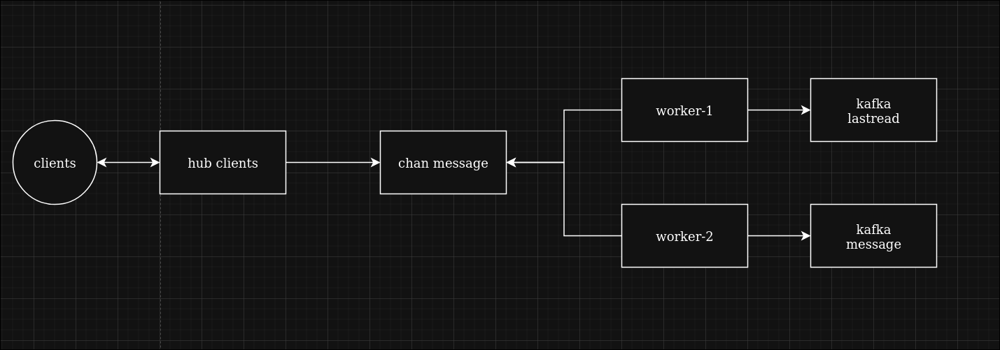

# Вебсокет

## Содержание:
- [Описание](#описание)
- [Реализация](#реализация)
- [Архитектура](#архитектура)
- [Структура директорий](#структура-директорий)

## Описание:
Этот сервис доставляет все обновления клиенту - с помощью WebSocket. Его зона ответсвенности - это хранения подключений и доставка сообщений других сервисов.

## Реализация:
Есть общий chan - в который передаются сообщения для отправки.
Есть hub clients, в котором хранятся все соединения клиентов в данной реплике. Этот хаб работает в бесконечном цыкле добавляя и убирая клиентов, а так же читает сообщения из chan, и отправляет на активные подключения нужным клиентам. 
Так же работают несколько воркеров, которые читают сообщения из брокеров сообщений, виды сообщений разделены по разным partitional и тоже передают в chan.
В дальнейшем сообщения сортируются по "type" на фронте и он решает, что с ними делать

## Архитектура:


## Структура директорий:
```text
.
├── cmd - запуск сервиса
├── config - конфиг
└── internal
    ├── ctxkey - переменные контекста
    ├── loglables - поля логирования
    ├── model - доменная модель для chan
    ├── transport - websocket, hub и client реализация
    └── worker - фоновые воркеры
```